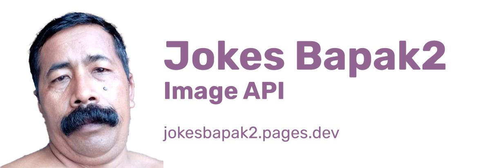

<h1 align="center">
<br>
  
  <br>
  <br>
  Jokes Bapak2 Image API
  <br>
</h1>

👋 Hey there! Still a work in progress, if you'd like to contribute this while this repo is still growing, that would be so great!

It's on alpha phase now. You can access the front facing web on [jokesbapak2.pages.dev](http://jokesbapak2.pages.dev/).

## Brief explanation of what is this

Jokes Bapak2 is an image API that you can use for free! I've been seeing lots and lots of Indonesian dad jokes on Twitter, Facebook and Instagram on early 2020. In a month, I made a Discord bot that provides the jokes. But I thought, why not make it as an API?

This is some kind of [icanhazdadjokes](https://icanhazdadjoke.com/) but it's Indonesian and it's not text, it's images. Dad jokes in Indonesia is somewhat a bit different than in US/UK because, I guess, here, it's a lot dumber.

## Project Directories

* `api` - REST API service. Created with Go with [Fiber](https://gofiber.io/) framework.
* `client` - Front facing website (front end). Created with [Svelte Kit](https://kit.svelte.dev/).

You can consume this API via a website (linked in the front facing web) with a few endpoints:

 * `/v1/` - Random jokes bapak2
 * `/v1/id/{number}` - Jokes bapak2 based on ID
 * `/v1/today` - Jokes bapak2 of the day
 * `/v1/total` - Total available jokes bapak2

Currently I'm (still) searching for an alternative for AWS S3 that I can use for free.

## Tech stacks

 * Go (for `api` / back end)
 * Node.js (for `client` / front end)
 * Postgres
 * Redis

That's it.

## Development

Two ways of doing this:
  1. Install all the tech stack on your local machine
  2. Using docker-compose

See [CONTRIBUTING](./CONTRIBUTING.md) or README files on each project directory for further instruction on how to run the development environment.

## License

Jokes Bapak2 API is licensed under [GNU GENERAL PUBLIC LICENSE v3 license](./LICENSE)

```
    Jokes Bapak2 API is a free-to-use image API of Indonesian dad jokes.
    Copyright (C) 2021-present  Jokes Bapak2 Contributors

    This program is free software: you can redistribute it and/or modify
    it under the terms of the GNU General Public License as published by
    the Free Software Foundation, either version 3 of the License, or
    (at your option) any later version.

    This program is distributed in the hope that it will be useful,
    but WITHOUT ANY WARRANTY; without even the implied warranty of
    MERCHANTABILITY or FITNESS FOR A PARTICULAR PURPOSE.  See the
    GNU General Public License for more details.

    You should have received a copy of the GNU General Public License
    along with this program.  If not, see <https://www.gnu.org/licenses/>.
```